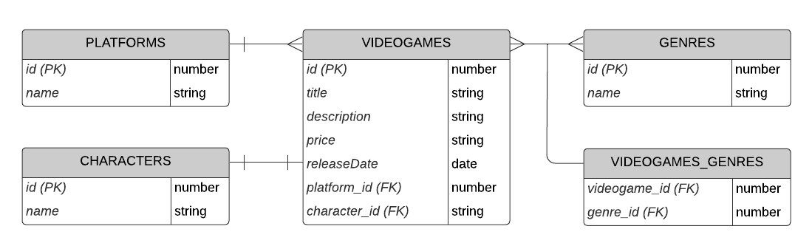

## Instrucciones para utilizar la Demo Videogames

## Instalar las dependencias en una terminal integrada

```bash
npm install
```

## Ingresar credenciales de PostgreSql

- Cambiar nombre del archivo ".example.env" a ".env"
- Ingresar tus credenciales de PostgreSQL en el archivo ".env"
  - Incluyendo el nombre de la base de datos que quieras utilizar

## Diagrama Entidad/Relación de la Demo



## Testear mediante Postman, Insomnia, ThunderClient, etc

### ▶POST PLATFORMS

- POST http://localhost:3000/videogames/platforms
  - Enviando por body

```json
{
  "name": "Plataforma-01"
}
```

### POST GENRES

- POST http://localhost:3000/videogames/genres
  - Enviando por body

```json
{
  "name": "Genero-01"
}
```

- POST http://localhost:3000/videogames/platforms
  - Enviando por body

```json
{
  "name": "Genero-02"
}
```

### POST CHARACTERS

- POST http://localhost:3000/videogames/characters
  - Enviando por body

```json
{
  "name": "Personaje-01"
}
```

### POST VIDEOGAMES

- POST http://localhost:3000/videogames
  - Enviando por body:

```json
{
  "title": "Juego Demo 01",
  "description": "Juego de ejemplo",
  "price": 50,
  "rating": 8,
  "releaseDate": "2024-07-16",
  "platform_id": 1,
  "genres": [1, 2],
  "character_id": 1
}
```

### GET VIDEOGAMES

- GET http://localhost:3000/videogames

### PUT VIDEOGAMES

- PUT http://localhost:3000/videogames/1
  - Enviando por body:

```json
{
  "title": "Nuevo nombre",
  "description": "Nueva descripción",
  "rating": 5,
  "platform_id": 1,
  "genres": [2],
  "character_id": 1
}
```

### DELETE VIDEOGAME

- DELETE http://localhost:3000/videogames/1
