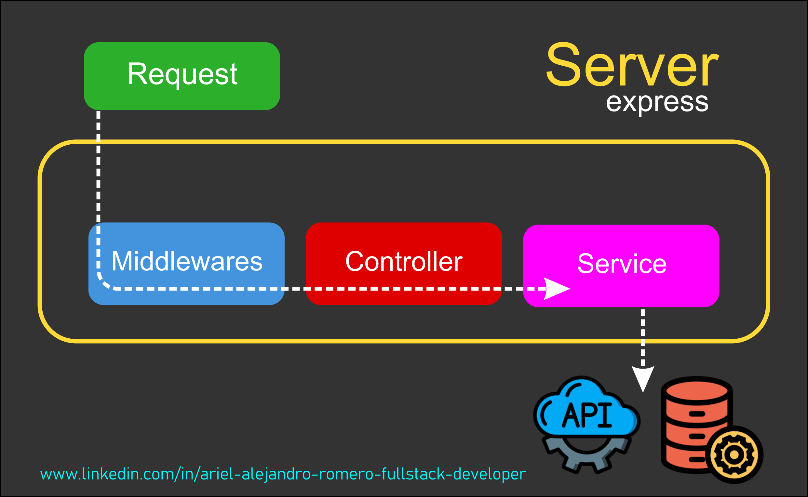

# M3-03 Express & TypeScript

[Volver a Inicio](../README.md)

## Links

- [TypeScript - Documentación](https://www.typescriptlang.org/)
- [Express - Documentación](https://expressjs.com/es/)
- [JSON WebTokken](https://jwt.io/)

## Links

- [Express - Documentación](https://expressjs.com/es/)
- [TypeScript - Documentación](https://www.typescriptlang.org/es/)
- [JWT - Documentación](https://jwt.io/)
- [Status Code - Cats](https://http.cat/)
- [Status Code - Dogs](https://http.dog/)

## Flow de Express

