# M3-14 JavaScript Avanzado

[Volver a Inicio](../README.md)

## Links

- [Calculadora de Logaritmos en Base 2](https://miniwebtool.com/es/log-base-2-calculator/)
- [Video sobre doblar papel](https://www.youtube.com/shorts/35loZtGK38k)

## Algoritmos

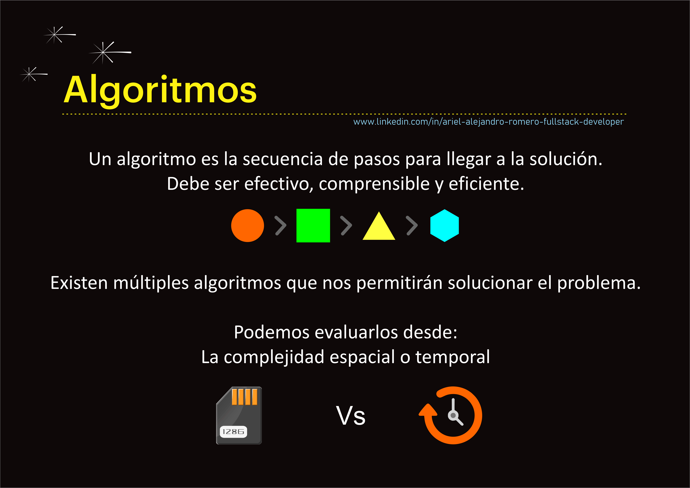

## Complejidad Temporal Vs Complejidad Espacial

> La complejidad temporal y la complejidad espacial son dos conceptos fundamentales en el análisis de algoritmos. A continuación, un resumen de cada uno de ellos:

## Complejidad Temporal

> La complejidad temporal se refiere a la cantidad de tiempo que un algoritmo tarda en ejecutarse en función del tamaño de la entrada. Esta se expresa generalmente usando la notación Big O, que proporciona una forma de describir el comportamiento de la función a medida que el tamaño de la entrada crece.

## Complejidad Espacial

> La complejidad espacial se refiere a la cantidad de memoria que un algoritmo necesita para ejecutarse en función del tamaño de la entrada. También se expresa usando la notación Big O.

## Formas de Crecimiento - Un ejemplo

## Crecimiento Constante

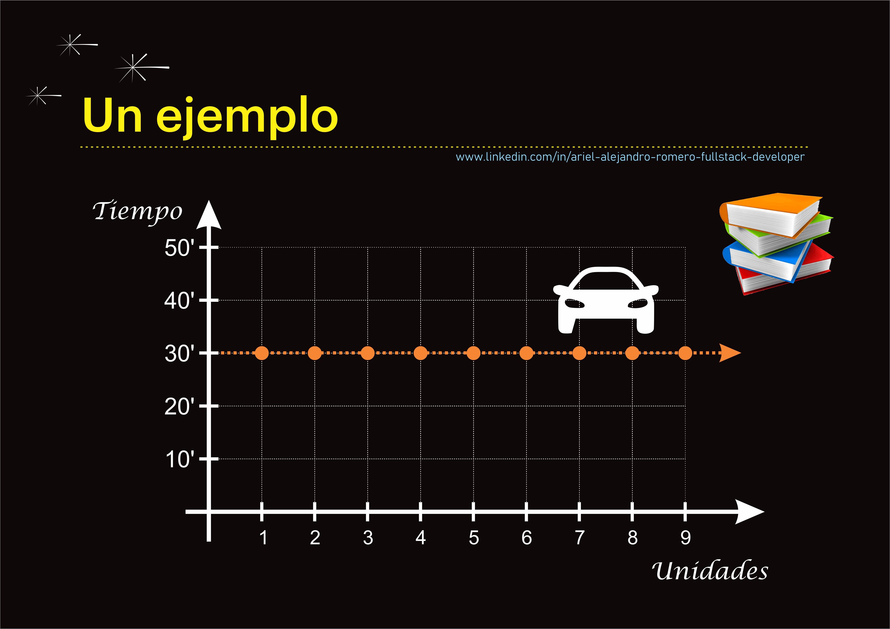

## Crecimiento Lineal

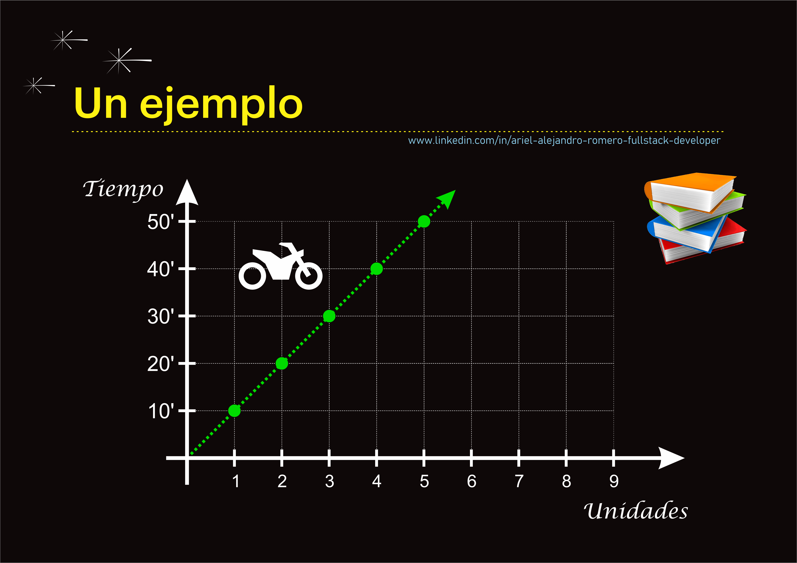

## Crecimiento Exponencial

### 🎯Un ejemplo de Crecimiento Exponencial:

- Si consideramos que el grosor de una hoja de papel es de 0,1 mm:
  - 17 dobleces: 1,3 metros
  - 22 dobleces: Altura de un edificio de 8 pisos
  - 30 dobleces: Altura del monte Everest
  - 45 dobleces: Distancia de la Tierra a la Luna
  - 54 dobleces: Distancia de la Tierra al Sol
  - 103 dobleces: Altura igual al Universo conocido

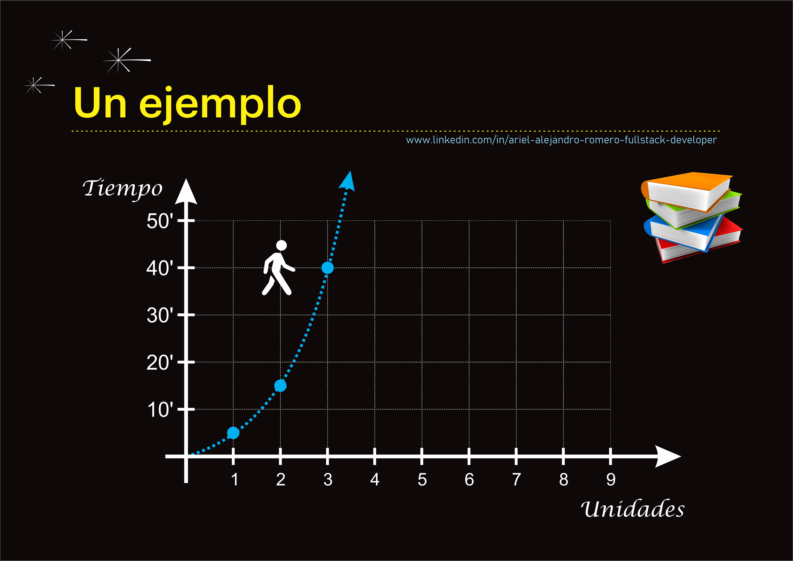

## ¿Qué sección del gráfico tomar?

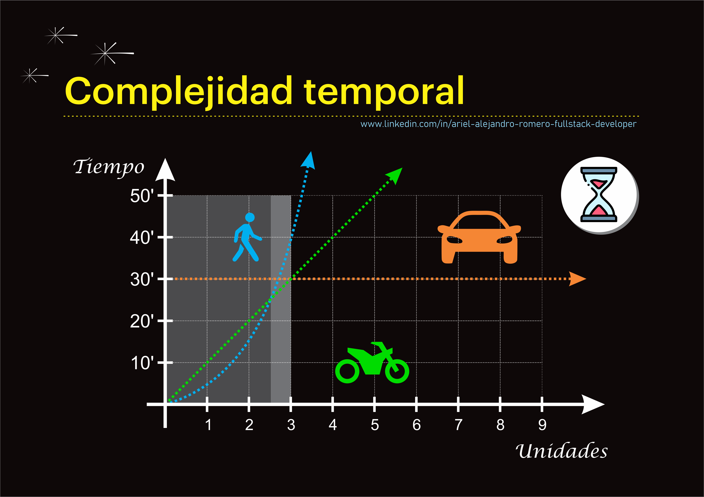

## ¿Qué es la complejidad temporal?

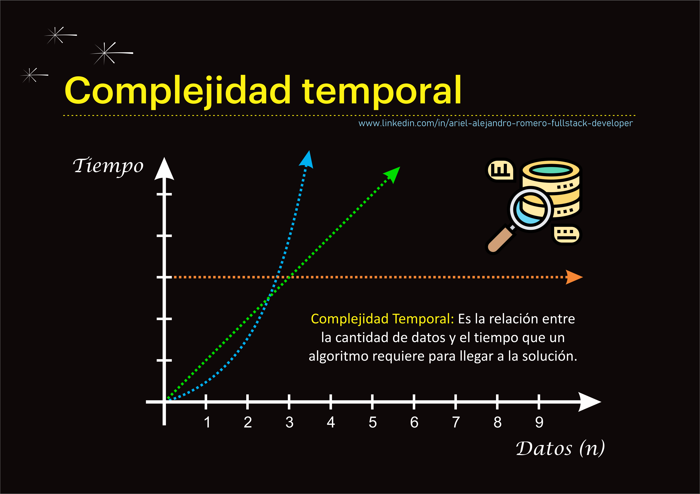

## Formas de Crecimiento

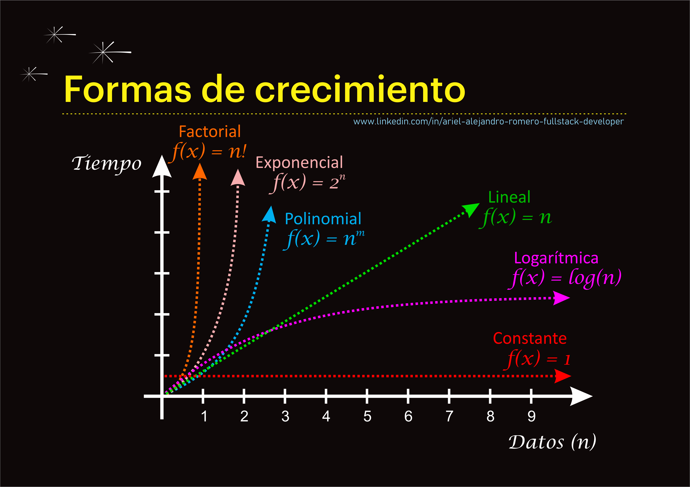

## ¿Cómo medimos la complejidad temporal?

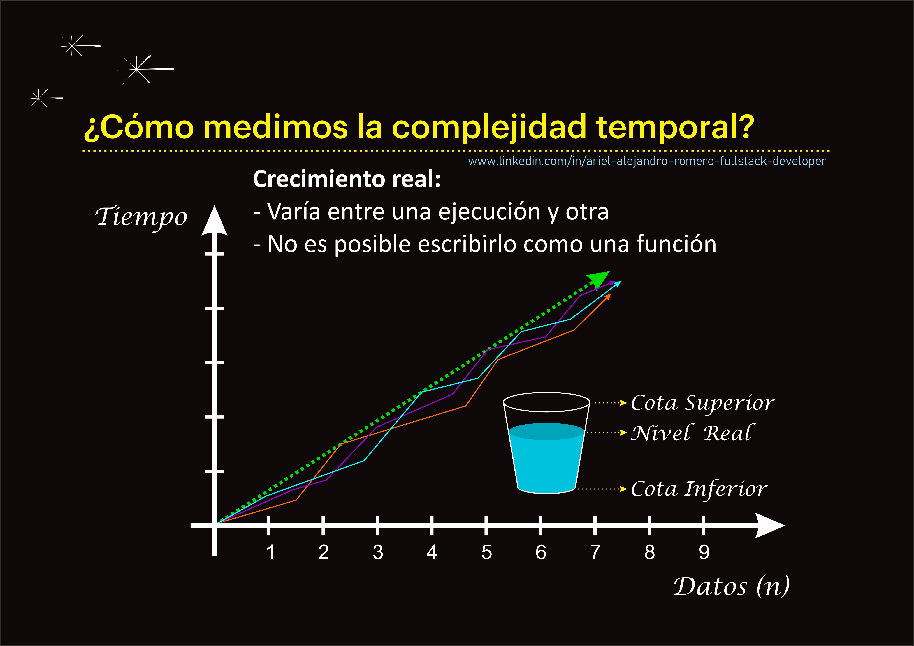

## ¿Qué es la Notación Asintótica o Big O?

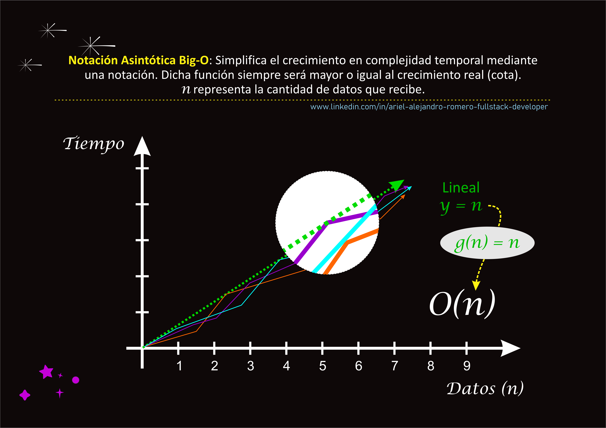

## Simplificación de la Anotación Asintótica Big-O

|       n |            n^2 |        n^2 + n | % que representa "n" sobre el total |
| ------: | -------------: | -------------: | ----------------------------------: |
|      10 |            100 |            110 |                                 10% |
|     100 |         10.000 |         10.100 |                                  1% |
|   1.000 |      1.000.000 |      1.001.000 |                                0.1% |
|  10.000 |    100.000.000 |    100.010.000 |                               0.01% |
| 100.000 | 10.000.000.000 | 10.000.100.000 |                              0.001% |

## Utilidad de la Notación Asintótica o Big O

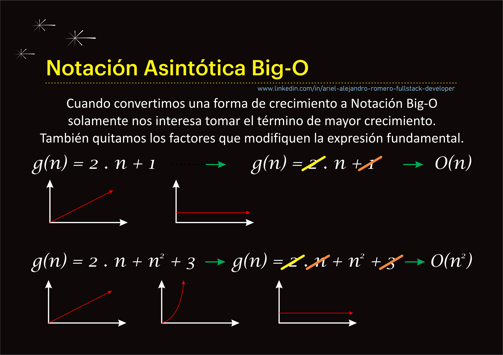

## Resumen de las formas de crecimiento según complejidad

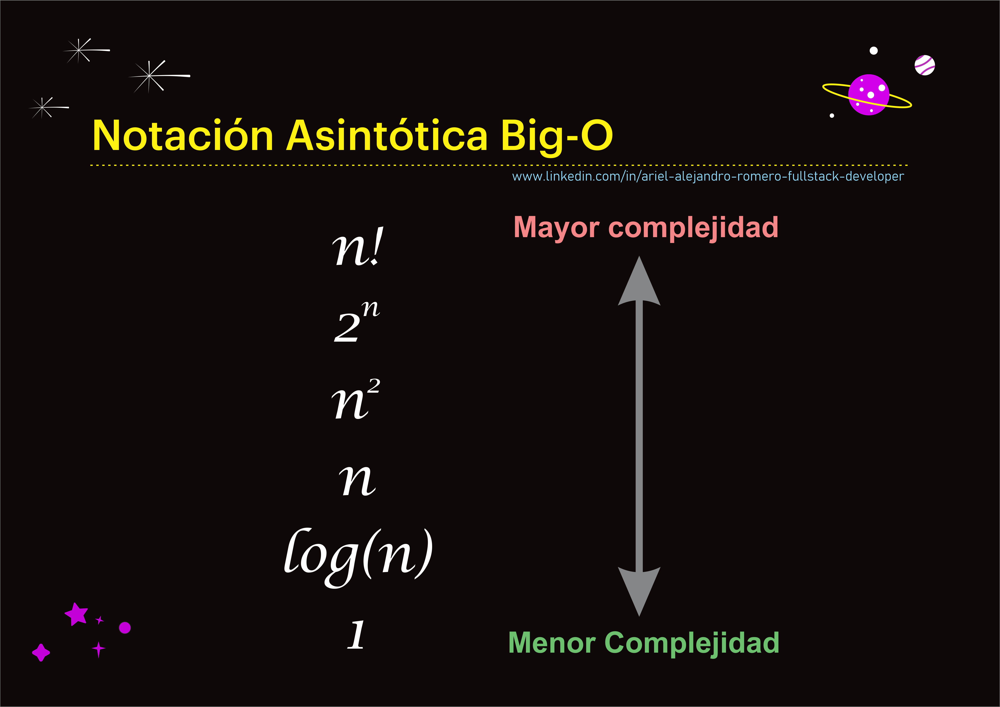

## Impacto de la Complejidad Temporal en Algoritmos Reales

### Tiempo empleado para procesar 1000 datos

| Complejidad Temporal | Pasos para procesar 1000 Datos |     Tiempo empleado |
| -------------------: | -----------------------------: | ------------------: |
|             O(Log n) |                             10 |    0.00001 segundos |
|                O(√n) |                             32 |    0.00003 segundos |
|                    n |                          1.000 |       0.001 segundo |
|                  n^2 |                      1.000.000 |           1 segundo |
|                  2^n |                  1.07 x 10^301 |  3.40 x 10^287 años |
|                   n! |                 4.02 x 10^2567 | 1.28 x 10^2554 años |

### Cantidad de datos capaz de procesar en un segundo

| Complejidad Temporal | Datos que puede procesar en 1 segundo |
| -------------------: | ------------------------------------: |
|             O(Log n) |                      > 1 x 10^300.000 |
|                O(√n) |                 1 x 10^12 (1 trillón) |
|                    n |                             1.000.000 |
|                  n^2 |                                 1.000 |
|                  2^n |                                    20 |
|                   n! |                                    10 |

## Definición formal

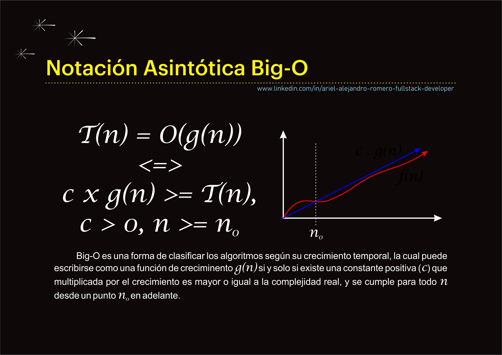

[Volver a Inicio](../README.md)
